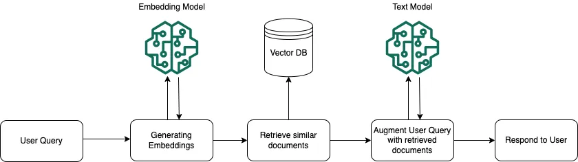
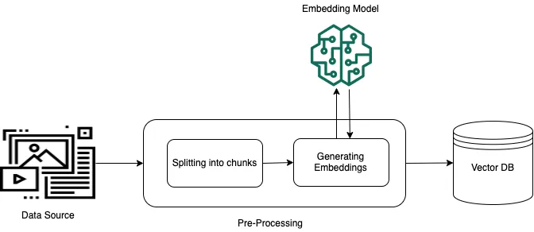
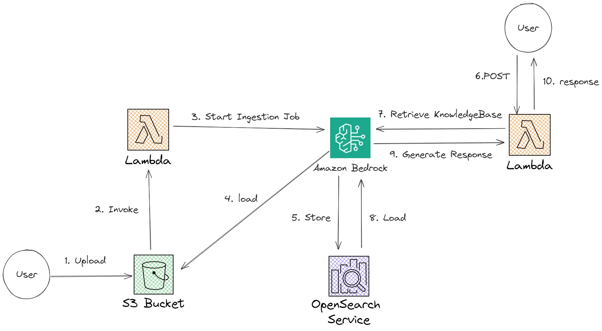

# Easy RAG App with Amazon Bedrock Knowledge Base for Resume-Driven Applications

This document provides a detailed guide to creating an application that uses Retrieval Augmented Generation (RAG) with Amazon Bedrock. In addition to delivering context-aware responses based on a knowledge base, the app accepts a person's resume and generates responses specifically tailored to the resume content. This guide is inspired by the AWS Community blog post "[Easy RAG with Amazon Bedrock Knowledge Base](https://community.aws/content/2bi5tqITxIperTzMsD3ohYbPIA4/easy-rag-with-amazon-bedrock-knowledge-base?lang=en#our-architecture)".

## Table of Contents

- [Problem Statement](#problem-statement)
- [Introduction](#introduction)
- [Efficiency Improvements](#efficiency-improvements)
- [Architecture Overview](#architecture-overview)
- [What is AWS CloudFormation?](#what-is-aws-cloudformation)
- [How AWS CDK Helps in Deployment](#how-aws-cdk-helps-in-deployment)
- [Implementation Details](#implementation-details)
  - [Prerequisites](#prerequisites)
  - [Step-by-Step Setup](#step-by-step-setup)
    - [1. Setting Up Amazon Bedrock](##1-setting-up-amazon-bedrock)
    - [2. Creating and Indexing the Knowledge Base](#2-creating-and-indexing-the-knowledge-base)
    - [3. Implementing the Retrieval Mechanism](#3-implementing-the-retrieval-mechanism)
    - [4. Integrating Resume Processing with RAG](#4-integrating-resume-processing-with-rag)
    - [5. Building the Frontend or API Layer](#5-building-the-frontend-or-api-layer)
  - [Testing and Validation](#testing-and-validation)
- [Conclusion](#conclusion)
- [References](#references)


## Problem Statement

Modern applications often struggle with:

- **Information Overload:** Processing vast amounts of data makes it difficult for generative models to focus on what’s relevant.
- **Generic Responses:** Without targeted context, responses generated by the model can be too broad or not tailored to a specific user's needs.
- **Inefficient Resource Use:** Handling excessive, unrelated data increases processing time and costs.

By using a RAG approach, the app narrows the context to only the most pertinent information. Furthermore, integrating a resume allows the system to personalize responses—making them highly relevant for job seekers, recruiters, or career advisors.

### Efficiency Improvements

- **Faster Response Times** 
- **Personalized Accuracy** 
- **Cost Efficiency** 
- **Scalability**

## Amazon Bedrock

Amazon Bedrock is a fully managed service that offers a choice of high-performing foundation models (FMs) from leading AI companies. 
It provides all of it via a single unified API Interface.

## RAG

Retrieval-augmented generation (RAG) is a technique in artificial intelligence that combines information retrieval with text generation. It's used to improve the quality of large language models (LLMs) by allowing them to access and process information from external knowledge bases. This app not only uses a knowledge base to generate responses but also accepts a resume file. By processing the resume content, the app can deliver answers tailored to an individual's background and experience.

#### Runtime Execution


#### RAG pre-processing


## Knowledge Bases for Amazon Bedrock

With a knowledge base, you can securely connect foundation models (FMs) in Amazon Bedrock to your company data for Retrieval Augmented Generation (RAG). Access to additional data helps the model generate more relevant, context-specific, and accurate responses without continuously retraining the FM.

Knowledge Bases for Amazon Bedrock manages the end-to-end RAG workflow for you. You specify the location of your data, select an embedding model to convert the data into vector embeddings, and have Amazon Bedrock create a vector store in your account to store the vector data. When you select this option (available only in the console), Amazon Bedrock creates a vector index in Amazon OpenSearch Serverless in your account, removing the need to manage anything yourself.

## What is AWS CloudFormation?

AWS CloudFormation is an Infrastructure-as-Code (IaC) service that allows developers to define and provision AWS infrastructure using templates. This approach enables:

- **Automated Deployment:** Consistently deploy infrastructure in an organized manner.
- **Version Control:** Track and update infrastructure configurations systematically.
- **Scalability & Reusability:** Reuse templates across multiple environments (dev, test, production) for consistent deployments.

## How AWS CDK Helps in Deployment

The AWS Cloud Development Kit (CDK) is a framework that simplifies CloudFormation deployments by allowing developers to write infrastructure as code in programming languages like Python, TypeScript, and Java. CDK provides:

- **Higher-Level Constructs:** Abstracted components to build AWS infrastructure efficiently.
- **IDE Integration:** Seamless deployment from an IDE without needing raw JSON/YAML templates.
- **Simplified CloudFormation Stack Management:** Directly synthesize and deploy CloudFormation stacks from code.

Developers can define an entire cloud environment—including Amazon Bedrock, S3, Lambda, API Gateway, and security settings—using AWS CDK and deploy everything with a single command (`cdk deploy`).

## Architecture Overview



The solution comprises the following components:

- **Knowledge Base:** A repository (using AWS S3, OpenSearch, or another indexing solution) that stores and indexes data/documents.
- **Retrieval Engine:** A component (often built using AWS Lambda functions) that processes queries to fetch relevant documents.
- **Resume Processor:** A module that ingests and parses resume files, extracting key information (skills, experience, education) to be used in constructing the prompt.
- **Amazon Bedrock:** The generative model service that combines the retrieved context and resume details to produce tailored responses.
- **Application Layer:** The frontend or API endpoints that facilitate user interaction—submitting queries and resumes, then displaying the responses.


## Implementation Details

### Prerequisites

Ensure you have the following before starting:

- An AWS account with access to Amazon Bedrock and related services (Lambda, S3, API Gateway, etc.).
- Necessary IAM roles and permissions for secure API calls.
- You should have AWS CLI configured for your IAM user to access and use AWS services from your computer.
- Familiarity with Python (or your chosen programming language) and REST API concepts.
- You should also have to install AWS CDK for the language that you will be using (i.e here as Javascript is used, we would use `npm install -g aws-cdk`)
- You also need Docker to be installed on your computer. 

> Note: You might might face an error while using docker reagarding WSL, ensure that you have installed WSL from Command Prompt using `wsl --update` or `wsl --update --web-download`. If this doesn't work for installing WSL, you can directly go to this [link](https://github.com/microsoft/WSL/releases/download/2.4.12/wsl.2.4.12.0.x64.msi) and download it.

***___After all of the pre-requisites are satisfied then only you may proceed with building application from blog.___***

### Preparing CDK project
1. Create a directory for project. (here we have created resume-ai folder, so, `mkdir resume-ai && cd resume-ai`)
2. Now, initialize the folder for our project with CDK's template (here for this project, we have used Javascript language)<br>
```cdk init app --language javascript```
3. Then create a dummy/testing resume file in resume-ai/data folder. (You would have to create data folder)
4. Now you would have to write code for creating lambda functions for
    
      i. Ingesting job in Knowledge Base, triggered when we upload data to specified S3 bucket. [in resume-ai/src/IngestJob folder with file named index.js]

  
      ii. Handling User request queries and return RAG reponse back to the user from Bedrock model. [in resume-ai/src/queryKnowledgeBase folder with file named index.js]

5.  Building our main CDK file which contains all of the constructs needed.[in resume-ai/lib folder with file named resume-ai-stack.js]
> Note that, this code will contain an errorneous line, specifically `new bedrock.KnowledgeBase`. Just swap 'KnowledgeBase' with 'VectorKnowledgeBase' and keep everything else same as it was.

> All of the code for lambda functions and main CDK consructs can be found in this [blog page](https://community.aws/content/2bi5tqITxIperTzMsD3ohYbPIA4/easy-rag-with-amazon-bedrock-knowledge-base) along with front-end code and dummy resume '.txt' file.
> Before deploying, you need to ensure all of the necessary dependencies are installed by using npm i command. Also there is an additional dependency that you need to install by writing npm i @cdklabs/generative-ai-cdk-constructs.

6. You can now deploy the CDK using `cdk deploy` which converts your written code into CloudFormation Stack. Sometimes you will get an error and will be prompted to use `cdk bootstrap`, please use it.

7. After successful deployment, you have to run `aws s3 sync data s3://your-newly-created-KB` command from your local terminal inside the resume-ai folder which syncs your S3 bucket and Knowledge Base.
> You can manually test the KB by going into AWS console and inside it, into Bedrock KB where you can test it by choosing a model.

8. You can now create a front-end app through which you can ask questions related to your own data and Bedrock model will answer you.

9. After using app, you can destroy it directly by using `cdk destroy --force`.

```bash
cdk init app --language javascript
``` 
## Conclusion

The RAG approach integrated with resume processing enhances the relevance of AI-generated responses. By retrieving only necessary data and refining the prompt with resume insights, the application delivers more personalized and efficient results.

## References

- [AWS Community Blog: Easy RAG with Amazon Bedrock Knowledge Base](https://community.aws/content/2bi5tqITxIperTzMsD3ohYbPIA4/easy-rag-with-amazon-bedrock-knowledge-base?lang=en#our-architecture)

