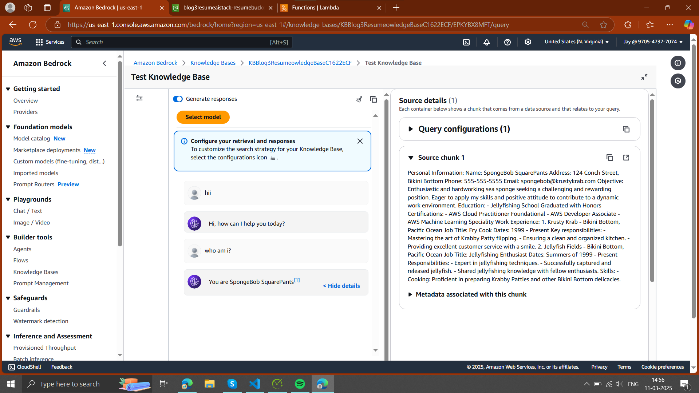
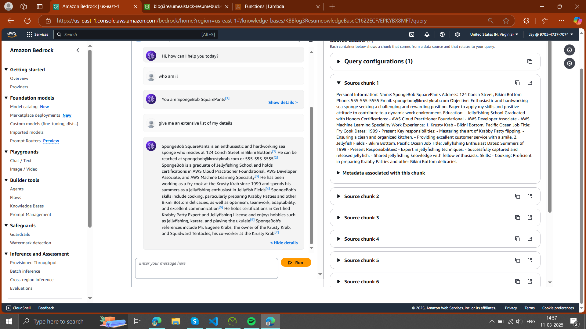
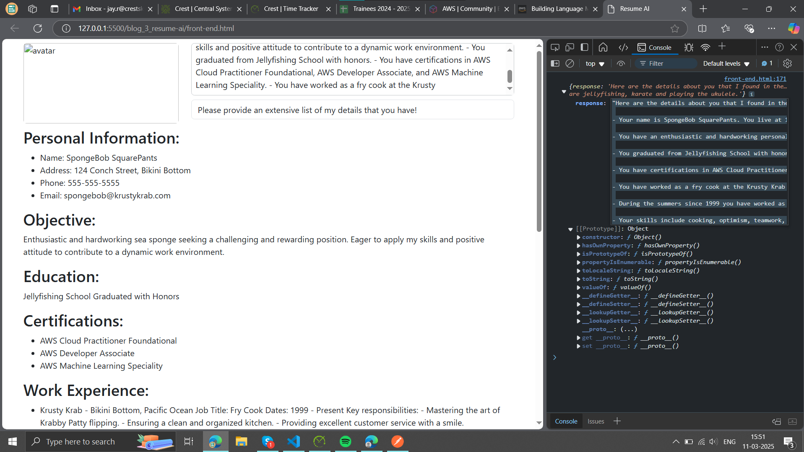

# Welcome to your CDK JavaScript project

This is a blank project for CDK development with JavaScript.

The `cdk.json` file tells the CDK Toolkit how to execute your app. The build step is not required when using JavaScript.

## Useful commands

* `npm run test`         perform the jest unit tests
* `npx cdk deploy`       deploy this stack to your default AWS account/region
* `npx cdk diff`         compare deployed stack with current state
* `npx cdk synth`        emits the synthesized CloudFormation template

Front-end integration (back-end is mostly necessary. for which we need to install necessary packages, note: node-fetch@2): 

# Easy RAG App with Amazon Bedrock Knowledge Base for Resume-Driven Applications

This document provides a detailed guide to creating an application that uses Retrieval Augmented Generation (RAG) with Amazon Bedrock. In addition to delivering context-aware responses based on a knowledge base, the app accepts a person's resume and generates responses specifically tailored to the resume content. This guide is inspired by the AWS Community blog post "[Easy RAG with Amazon Bedrock Knowledge Base](https://community.aws/content/2bi5tqITxIperTzMsD3ohYbPIA4/easy-rag-with-amazon-bedrock-knowledge-base?lang=en#our-architecture)".

## Table of Contents

- [Introduction](#introduction)
- [Problem Statement](#problem-statement)
- [Efficiency Improvements](#efficiency-improvements)
- [Architecture Overview](#architecture-overview)
- [What is AWS CloudFormation?](#what-is-aws-cloudformation)
- [How AWS CDK Helps in Deployment](#how-aws-cdk-helps-in-deployment)
- [Implementation Details](#implementation-details)
  - [Prerequisites](#prerequisites)
  - [Step-by-Step Setup](#step-by-step-setup)
    - [1. Setting Up Amazon Bedrock](#1-setting-up-amazon-bedrock)
    - [2. Creating and Indexing the Knowledge Base](#2-creating-and-indexing-the-knowledge-base)
    - [3. Implementing the Retrieval Mechanism](#3-implementing-the-retrieval-mechanism)
    - [4. Integrating Resume Processing with RAG](#4-integrating-resume-processing-with-rag)
    - [5. Building the Frontend or API Layer](#5-building-the-frontend-or-api-layer)
  - [Testing and Validation](#testing-and-validation)
- [Conclusion](#conclusion)
- [References](#references)

## Introduction

Retrieval Augmented Generation (RAG) combines a powerful retrieval mechanism with state-of-the-art generative models. This hybrid approach allows applications to extract the most relevant pieces of information from large datasets and provide context-aware responses. This app not only uses a knowledge base to generate responses but also accepts a resume file. By processing the resume content, the app can deliver answers tailored to an individual's background and experience.

## Problem Statement

Modern applications often struggle with:

- **Information Overload:** Processing vast amounts of data makes it difficult for generative models to focus on what’s relevant.
- **Generic Responses:** Without targeted context, responses generated by the model can be too broad or not tailored to a specific user's needs.
- **Inefficient Resource Use:** Handling excessive, unrelated data increases processing time and costs.

By using a RAG approach, the app narrows the context to only the most pertinent information. Furthermore, integrating a resume allows the system to personalize responses—making them highly relevant for job seekers, recruiters, or career advisors.

## Efficiency Improvements

Implementing RAG with resume integration offers significant advantages:

- **Faster Response Times:** Retrieving only the necessary data reduces the load on the generative model, leading to quicker outputs.
- **Personalized Accuracy:** Tailoring the prompt with resume details improves the accuracy and relevance of the responses.
- **Cost Efficiency:** Minimizing the data processed lowers computational resources and overall costs.
- **Scalability:** A modular design allows the system to scale easily as both data and user requests grow.

## Architecture Overview

The solution comprises the following components:

- **Knowledge Base:** A repository (using AWS S3, OpenSearch, or another indexing solution) that stores and indexes data/documents.
- **Retrieval Engine:** A component (often built using AWS Lambda functions) that processes queries to fetch relevant documents.
- **Resume Processor:** A module that ingests and parses resume files, extracting key information (skills, experience, education) to be used in constructing the prompt.
- **Amazon Bedrock:** The generative model service that combines the retrieved context and resume details to produce tailored responses.
- **Application Layer:** The frontend or API endpoints that facilitate user interaction—submitting queries and resumes, then displaying the responses.

Refer to the original blog’s "Our Architecture" section for a detailed diagram and further insights.

## What is AWS CloudFormation?

AWS CloudFormation is an Infrastructure-as-Code (IaC) service that allows developers to define and provision AWS infrastructure using templates. This approach enables:

- **Automated Deployment:** Consistently deploy infrastructure in an organized manner.
- **Version Control:** Track and update infrastructure configurations systematically.
- **Scalability & Reusability:** Reuse templates across multiple environments (dev, test, production) for consistent deployments.

## How AWS CDK Helps in Deployment

The AWS Cloud Development Kit (CDK) is a framework that simplifies CloudFormation deployments by allowing developers to write infrastructure as code in programming languages like Python, TypeScript, and Java. CDK provides:

- **Higher-Level Constructs:** Abstracted components to build AWS infrastructure efficiently.
- **IDE Integration:** Seamless deployment from an IDE without needing raw JSON/YAML templates.
- **Simplified CloudFormation Stack Management:** Directly synthesize and deploy CloudFormation stacks from code.

Developers can define an entire cloud environment—including Amazon Bedrock, S3, Lambda, API Gateway, and security settings—using AWS CDK and deploy everything with a single command (`cdk deploy`).

## Implementation Details

### Prerequisites

Ensure you have the following before starting:

- An AWS account with access to Amazon Bedrock and related services (Lambda, S3, API Gateway, etc.).
- Necessary IAM roles and permissions for secure API calls.
- Familiarity with Python (or your chosen programming language) and REST API concepts.
- Basic understanding of resume parsing and text extraction techniques.

### Step-by-Step Setup

#### 1. Setting Up Amazon Bedrock

- **Service Access:** Confirm that Amazon Bedrock is available in your region and subscribe if needed.
- **IAM Configuration:** Create IAM roles with permissions to invoke Bedrock models securely.
- **Initial Testing:** Conduct test invocations to validate that your credentials and setup are functioning properly.

#### 2. Creating and Indexing the Knowledge Base

- **Data Ingestion:** Gather documents such as FAQs, manuals, support articles, and other context-relevant content.
- **Data Storage:** Store the documents in AWS S3 or a similar repository.
- **Indexing:** Use Amazon OpenSearch or a custom indexing solution to index the documents for fast and accurate retrieval.

#### 3. Implementing the Retrieval Mechanism

- **Query Parsing:** Develop an AWS Lambda function or similar component to process incoming queries, extract key terms, and generate search queries.
- **Retrieval Logic:** Implement a retrieval algorithm (e.g., BM25 or vector similarity search) to search the knowledge base and return the most relevant content.
- **API Exposure:** Expose this functionality through an API (using Amazon API Gateway) so that other components can fetch context data.

#### 4. Integrating Resume Processing with RAG

- **Resume Ingestion:** Create a module that accepts resume files (e.g., PDF, DOCX, or plain text). Use libraries such as Apache Tika, PyPDF2, or similar to extract text.
- **Resume Parsing:** Analyze the extracted resume text to identify key sections—skills, work experience, education, and certifications.
- **Prompt Enhancement:** Merge the parsed resume data with the retrieved knowledge base context.
- **Model Invocation:** Use the AWS SDK to call the `invoke_model` API of Amazon Bedrock.

### Testing and Validation

- **Unit Testing:** Write tests for individual components (resume extraction, query processing, model invocation).
- **Integration Testing:** Validate the full workflow.
- **Performance Monitoring:** Use AWS CloudWatch to monitor API performance.

## Conclusion

The RAG approach integrated with resume processing enhances the relevance of AI-generated responses. By retrieving only necessary data and refining the prompt with resume insights, the application delivers more personalized and efficient results.

## References

- [AWS Community Blog: Easy RAG with Amazon Bedrock Knowledge Base](https://community.aws/content/2bi5tqITxIperTzMsD3ohYbPIA4/easy-rag-with-amazon-bedrock-knowledge-base?lang=en#our-architecture)

